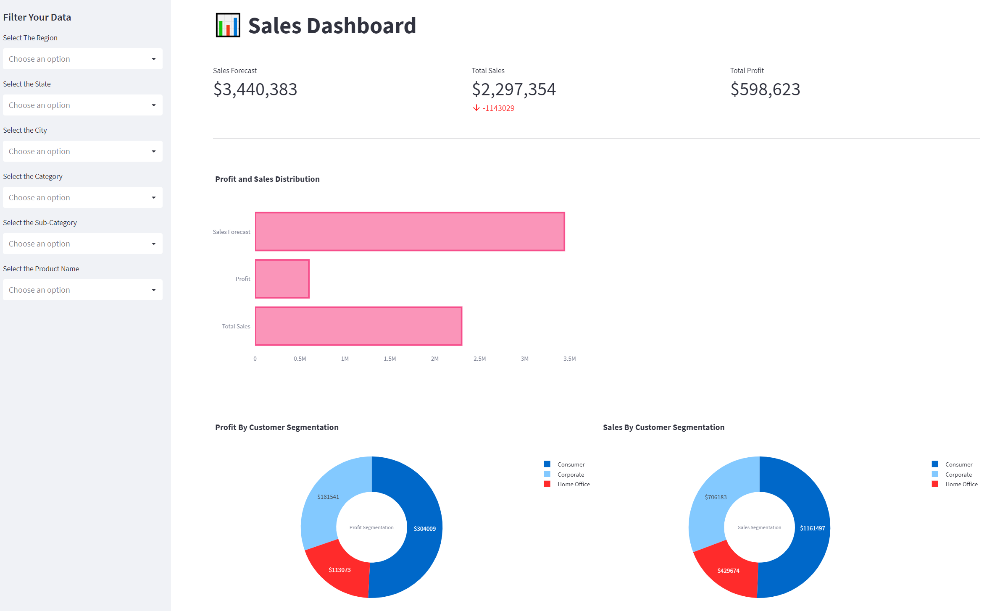

# Sales Dashboard App

Welcome to the Sales Dashboard App! This web application is designed to help you visualize your sales data in a dynamic and interactive way. With this app, you can filter your sales data by Region, State, City, Category, Sub-Category, and Product Name, and observe various visualizations generated by the app based on your filtered data.

The app offers a range of features that enable you to gain insights into your sales performance quickly and easily. You can view key performance indicators such as Total Sales, Total Profit, and Sales Forecast, and gain a deeper understanding of your profit and sales distribution with our Profit and Sales Distribution chart. In addition, the app provides a Profit by Customer Segmentation chart and a Sales by Customer Segmentation chart, allowing you to identify the most profitable customer segments and adjust your sales strategy accordingly.

Getting started with the Sales Dashboard App is easy, and all you need is Python 3, Streamlit, Pandas, PIL, and Plotly installed on your computer. Simply clone this repository, install the required packages, and run the app.py file to start using the app. I hope my Sales Dashboard App helps you gain valuable insights into your sales performance and make data-driven decisions that improve your bottom line!

Meet John, a sales manager at a company that sells office supplies. John has been tasked with analyzing the sales data for the past year and presenting his findings to the executive team. However, he's having trouble making sense of the vast amount of data.

That's when John discovers the Sales Dashboard App. With this app, he's able to easily filter the data by region, state, city, category, sub-category, and product name. The app generates various visualizations based on the filtered data, allowing John to quickly identify trends and patterns in the sales data.

Using the app, John is able to create a comprehensive report on the sales data, complete with key performance indicators, profit and sales distribution charts, and customer segmentation charts. With his report in hand, John confidently presents his findings to the executive team, impressing them with his insights and recommendations for improving sales.

Thanks to the Sales Dashboard App, John was able to quickly and easily analyze the sales data and provide valuable insights to his company.

To view the Streamlit App, click [here](./app.py).
Deployable Streamlit App: https://superstoresales.streamlit.app/

---

## Getting Started
To get started, you need to have the following installed:

    Python 3
    Streamlit
    Pandas
    PIL
    Plotly
    
---

## Installation

- Clone this repository.

- Navigate to the directory of the cloned repository.

- pip install -r requirements.txt

---

## Usage
Run the app.py file.
    
    streamlit run app.py

Wait for the app to open in your default web browser.
Select the filters you want to apply to the data from the sidebar.
Observe the various visualizations generated by the app based on your filtered data.

## Features

### Sidebar Filters

The sidebar allows users to filter the sales data by Region, State, City, Category, Sub-Category, and Product Name.

### Key Performance Indicators
The main page of the app displays three key performance indicators:

- Total Sales: The total amount of sales in the selected data.

- Total Profit: The total amount of profit in the selected data.

- Sales Forecast: The forecasted amount of sales in the selected data.

### Profit and Sales Distribution

The Profit and Sales Distribution chart displays the total sales, total profit, and sales forecast as horizontal bars.

### Profit by Customer Segmentation

The Profit by Customer Segmentation chart displays the profit earned by each customer segment as a pie chart.

### Sales by Customer Segmentation
The Sales by Customer Segmentation chart displays the total sales by each customer segment as a pie chart.

---

## High-level walk through:

- The user opens the app in their web browser.

- The main page of the app displays three key performance indicators: Total Sales, Total Profit, and Sales Forecast.

- The user can filter the sales data by Region, State, City, Category, Sub-Category, and Product Name using the sidebar filters.

- Once the user selects the filters they want to apply, the app generates various visualizations based on the filtered data.

- The Profit and Sales Distribution chart displays the total sales, total profit, and sales forecast as horizontal bars.

- The Profit by Customer Segmentation chart displays the profit earned by each customer segment as a pie chart.

- The Sales by Customer Segmentation chart displays the total sales by each customer segment as a pie chart.

- The user can observe the various visualizations generated by the app based on their filtered data.

- The user can continue to adjust their filters and observe the updated visualizations until they have gained insight into the sales data they are interested in analyzing.

- Once the user is done, they can close the app.
